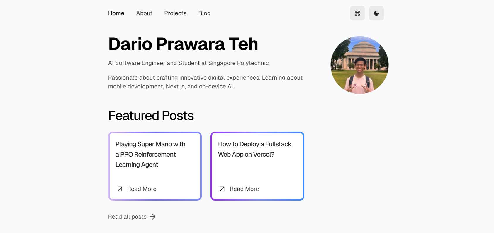

## 🎓 Vercel Portfolio Website

This is version 2 of my original portfolio website, leveraging on Next.js, Drizzle, TypeScript and Vercel for deployment.

- **Framework**: [Next.js](https://nextjs.org/)
- **Database**: [Vercel Postgres](https://vercel.com)
- **ORM**: [Drizzle](https://orm.drizzle.team/)
- **Authentication**: [NextAuth.js](https://next-auth.js.org/)
- **Deployment**: [Vercel](https://vercel.com)
- **Styling**: [Tailwind CSS](https://tailwindcss.com/)

## Overview

- `src/content/*` - MDX data that is used for my blog
- `src/lib/*` - Short for "library", a collection of helpful utilities or code for external services.
- `src/app/*` - The actual pages.
- `public/*` - Static assets including fonts and images.
- `src/styles/*` - Global CSS styles can be found here.
- `src/messages/*` - All translations objects (Only `en.json` is currently used).